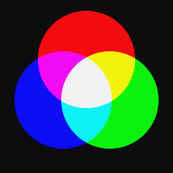

# Pretty Number Machine

An interactive visualisation of prime factorisation, where **a number's colour
is its factorisation**.

2 is red. 3 is green. 5 is blue. So 6 is yellow, because 6 = 2 × 3 and red plus
green is yellow. 30 = 2 × 3 × 5 goes white. Nothing is looked up or assigned —
the colour is computed from the factors, so numbers that are mathematically
related look related.

That is the whole idea, and it is why the app icon is three overlapping discs:
it *is* 30.

## Running it

No build step, no package manager, no dependencies to install. Native ES
modules and a locally vendored Three.js. Serve the directory over HTTP:

```bash
python -m http.server 8000
```

Then open `http://localhost:8000`. Opening `index.html` directly off disk will
not work — ES modules require a real origin.

It also installs as an app and runs with no network connection.

## Layout

| Path | What it is |
|---|---|
| `core/` | State bus, prime maths, layout, control panel, Three.js renderer |
| `modules/` | Optional features, registered at boot and isolated from crashes |
| `lib/` | Vendored Three.js and Space Grotesk — see THIRD-PARTY.md |
| `sw.js` | Service worker for the web builds. **Bump `CACHE_VERSION` on any deploy.** |
| `docs/HANDOFF.md` | **Start here.** Where things stand, decisions, traps, codebase directory |
| `docs/ANDROID-BUILD.md` | The plan for the Google Play build (Capacitor, achievements, in-app product) |
| `docs/PLAN.md`, `docs/V1-PLAN.md` | Charter and history of the web app |
| `docs/archive/` | Superseded documents, kept for history |

## Licence

Copyright © 2026 Dakota Schuck. All rights reserved — see [LICENSE](LICENSE).
The source is published so it can be read and evaluated, not reused. Bundled
third-party components under `lib/` keep their own licences.
